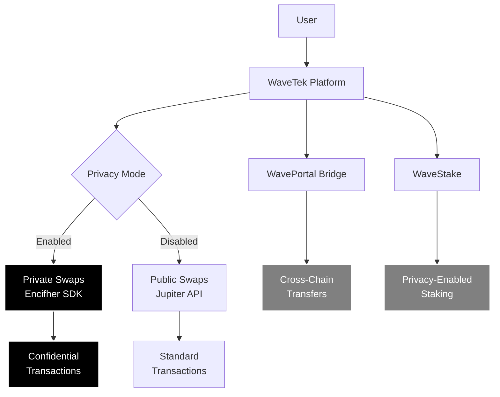
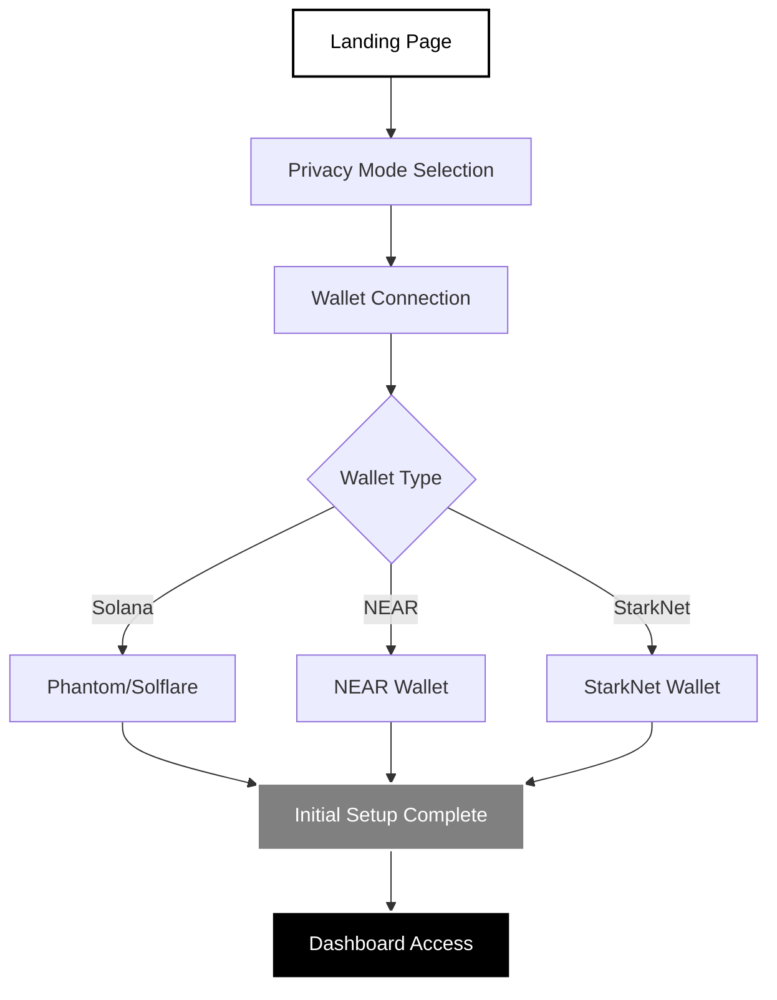
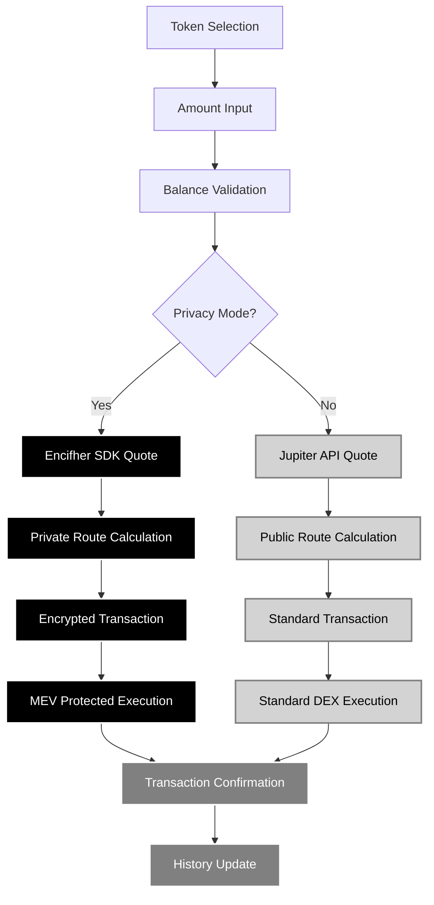
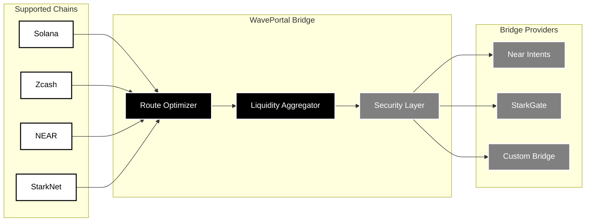
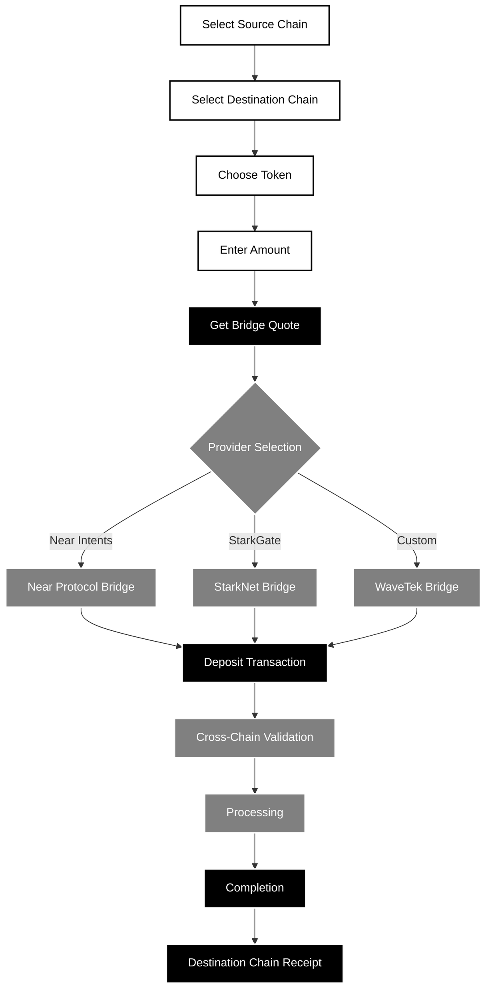
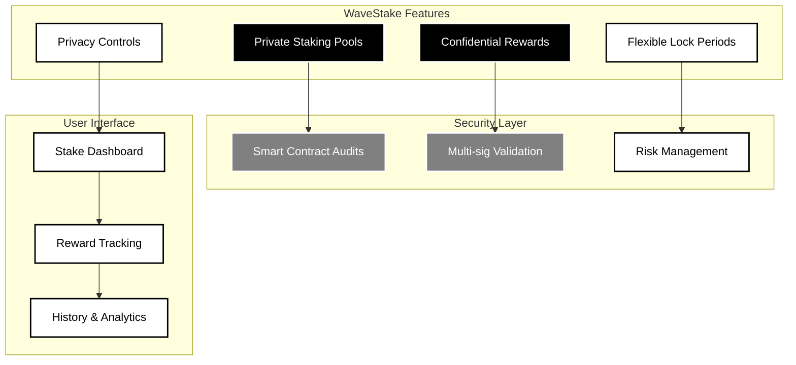
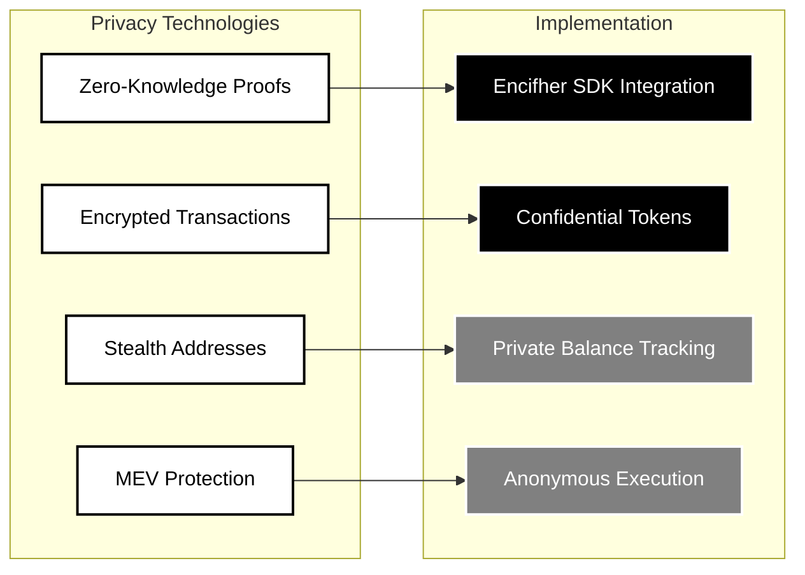
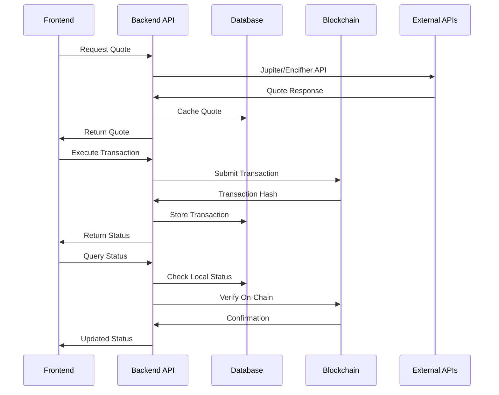
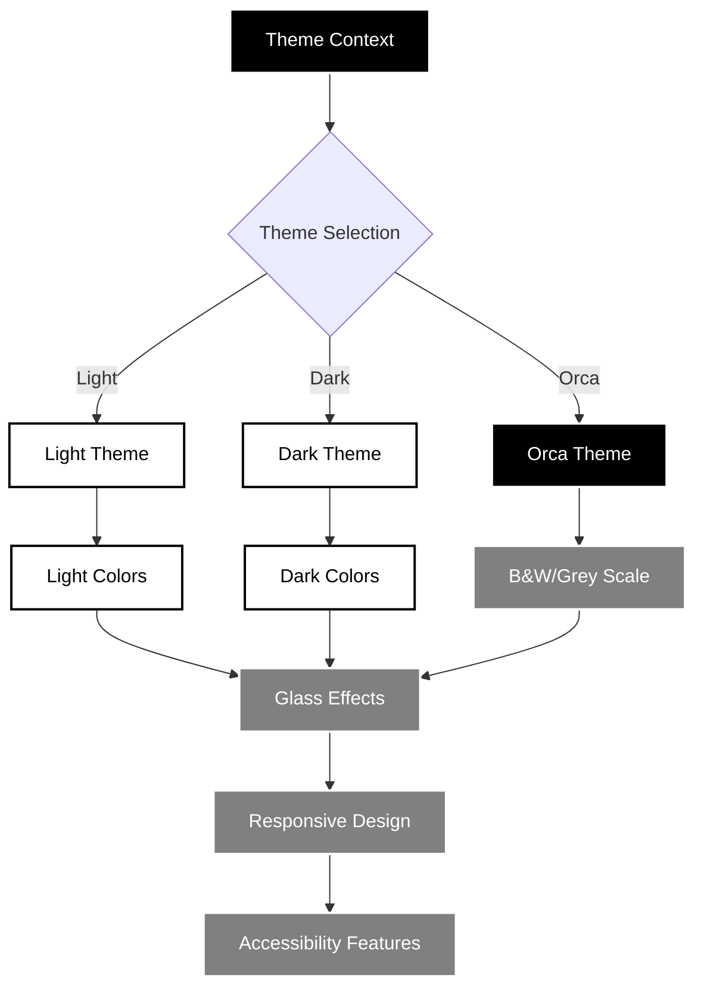

# WAVETEK: Privacy-Preserving Multi-Chain DEX

## Executive Summary

WaveTek is a privacy-preserving decentralized exchange (DEX) aggregator built on Solana that enables confidential token swaps, cross-chain bridging, and staking. Our platform combines institutional-grade privacy with user-friendly interfaces to provide secure, fast, and private DeFi transactions.

### Platform Overview



## System Architecture

### Core Technology Stack

| Layer | Technology | Purpose |
|-------|------------|---------|
| **Frontend** | Next.js 15.5.6 + TypeScript | React-based web application |
| **Backend** | Express.js + Prisma ORM | API server and database management |
| **Blockchain** | Solana Web3.js | Primary blockchain integration |
| **Privacy** | Encifher SDK | Confidential transaction processing |
| **Aggregation** | Jupiter API | DEX aggregation for public swaps |
| **Styling** | Tailwind CSS + Glass Morphism | Modern responsive UI design |

### Component Architecture

```
┌─────────────────────────────────────────────────────────────┐
│                    WaveTek Frontend                         │
├─────────────────────────────────────────────────────────────┤
│  AppTabs (Main Navigation)                                  │
│  ├── WaveSwap (DEX Aggregator)                             │
│  ├── WavePortal (Cross-Chain Bridge)                       │
│  ├── WaveStake (Staking Interface)                         │
│  └── History (Transaction History)                         │
├─────────────────────────────────────────────────────────────┤
│  Global Components                                          │
│  ├── Theme Context (Light/Dark/Orca Themes)                │
│  ├── Privacy Context (Global Privacy Mode)                 │
│  ├── Wallet Providers (Solana/NEAR/StarkNet)               │
│  └── Settings & Configuration                              │
└─────────────────────────────────────────────────────────────┘
```

## User Flow Documentation

### 1. New User Onboarding Journey



### 2. WaveSwap - Privacy-First Token Swapping

#### Swap Process Flow



#### Privacy vs Public Swap Flow

**Private Swap (Encifher SDK):**
1. User selects tokens and amount
2. System routes to Encifher SDK for confidential quote
3. Zero-knowledge proofs generated
4. Encrypted transaction created
5. MEV-protected execution
6. Private confirmation

**Public Swap (Jupiter API):**
1. User selects tokens and amount
2. System routes to Jupiter API for standard quote
3. Multi-DEX route optimization
4. Standard transaction created
5. Normal DEX execution
6. Public confirmation

### 3. WavePortal - Cross-Chain Bridge

#### Bridge Architecture



#### Bridge Process Flow



### 4. WaveStake - Privacy-Enabled Staking

#### Staking Architecture



## Privacy & Security Architecture

### Privacy Technologies



### Security Measures

| Security Feature | Implementation | Purpose |
|------------------|----------------|---------|
| **Multi-sig Wallets** | 2-of-3 signature scheme | Prevent single point of failure |
| **Smart Contract Audits** | Third-party security audits | Code vulnerability assessment |
| **Time-locked Transactions** | Optional delay periods | Added security layer |
| **Rate Limiting** | API endpoint protection | Prevent abuse and attacks |
| **Input Validation** | Comprehensive validation | Prevent injection attacks |
| **Encryption at Rest** | Database encryption | Data protection |

## API Architecture

### API Endpoint Structure

```
/api/v1/
├── swap/
│   ├── quote (GET/POST)     # Jupiter/Encifher routing
│   └── execute (POST)       # Transaction execution
├── bridge/
│   ├── quote               # Bridge rate quotes
│   ├── deposit/submit      # Deposit transactions
│   ├── status              # Transaction status
│   └── tokens              # Supported tokens
├── jupiter/[...path]       # Jupiter API proxy
├── encifher/
│   ├── quote              # Private swap quotes
│   ├── execute            # Private transaction execution
│   ├── balance            # Private balance queries
│   └── status             # Private transaction status
└── defuse/
    ├── quote              # Defuse bridge integration
    └── intent             # Intent-based transactions
```

### Data Flow Architecture



## Design System & UI/UX

### Theme Architecture



### Color Palette

| Theme | Primary | Secondary | Background | Text |
|-------|---------|-----------|------------|------|
| **Light** | #264af5 | #10b981 | #ffffff | #1e293b |
| **Dark** | #264af5 | #10b981 | #0f172a | #f8fafc |
| **Orca** | #264af5 | #808080 | #000000 | #ffffff |

### UI Components

- **Glass Morphism**: Sophisticated backdrop blur effects
- **Animated Gradients**: Dynamic background animations
- **Privacy Indicators**: Visual feedback for privacy mode
- **Responsive Design**: Mobile-first approach
- **Accessibility**: WCAG 2.1 compliance

## Token Integration

### Supported Token Standards

| Blockchain | Standard | Example |
|------------|----------|---------|
| **Solana** | SPL Tokens | SOL, USDC, WAVE |
| **Zcash** | Native ZEC | ZEC |
| **NEAR** | NEP-141 | NEAR, USDT |
| **StarkNet** | ERC-20 | ETH, USDC |

### Token Management Features

- **Jupiter Token List**: Comprehensive SPL token registry
- **Automatic Icon Fetching**: Multi-source token icon loading
- **Real-time Price Updates**: Live price feeds and market data
- **Balance Tracking**: Multi-chain balance aggregation
- **Privacy Support**: Confidential token balances

## Roadmap & Future Development

### Planned Features

1. **Advanced Privacy Options**
   - Granular privacy controls
   - Custom privacy levels
   - Advanced stealth features

2. **Expanded Chain Support**
   - Additional blockchain networks
   - Cross-chain liquidity aggregation
   - Multi-chain composability

3. **Institutional Features**
   - Enterprise-grade privacy
   - Compliance tools
   - Advanced reporting

4. **Mobile Application**
   - React Native mobile app
   - Native privacy features
   - Biometric authentication

## Conclusion

WaveTek represents the next generation of privacy-preserving DeFi infrastructure, combining cutting-edge cryptography with user-friendly design. Our platform addresses the growing need for confidential blockchain transactions while maintaining the accessibility and functionality expected from modern DeFi applications.

Through our multi-chain architecture, institutional-grade privacy features, and commitment to user experience, WaveTek is positioned to become the leading platform for private digital asset transactions.

---

*This document represents the current state of the WaveTek platform and is subject to updates as we continue to innovate and expand our privacy-preserving DeFi ecosystem.*